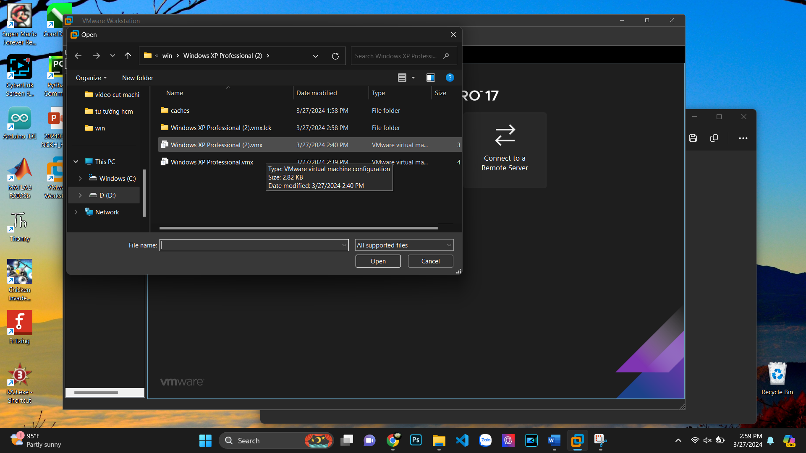
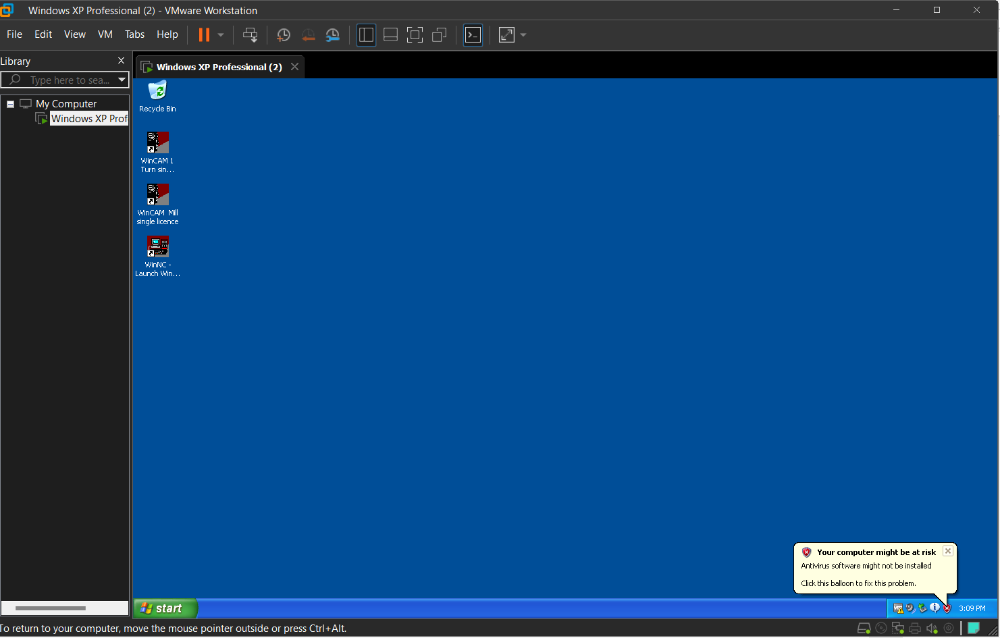
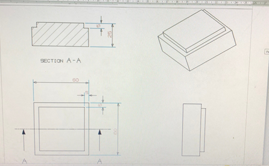
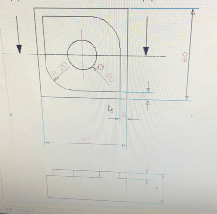
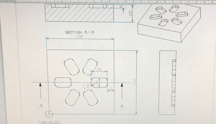
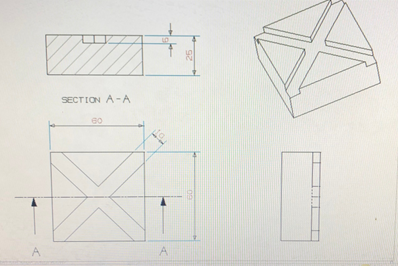
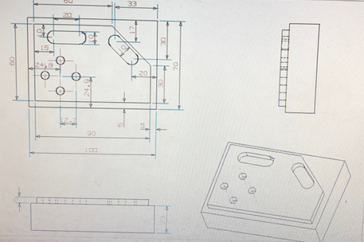
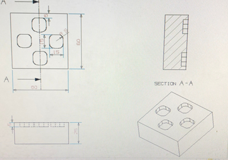
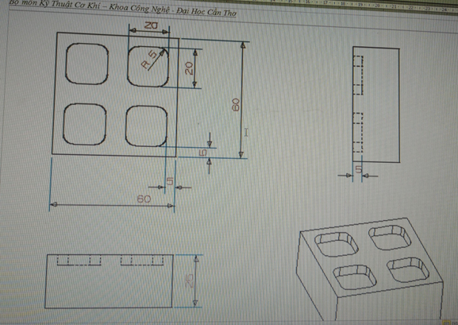

# Hướng dẫn cài đặt chương trình WINCAM CNC cho môn học CAD-CAM-CNC của CTU

Link tải phần mềm tại đây [link](https://drive.google.com/drive/folders/1kGjZQqTp6vLFJtB1hogBdFSJD0vARNh6?usp=sharing)

- Bước 1: Giải nén tệp tin đã chọn
- Bước 2: Cài đặt phần mềm VMware để cài đặt WINDXP ảo (chạy file VMware-workstation-full-17.5.0-22583795 (1).exe) khi cài đặt nhớ chú ý bỏ chọn phần kiểm tra update để tránh bị update.
- Bước 3: Khi cài xong VMware thì sẽ được yêu cầu nhập Key. Bạn cần mở file keyWM17.txt và copy một trong các key trong file để chạy tiếp
- Bước 4: Sắp xong rồi nha! bạn mở phần mềm VMware và làm theo các bước dưới đây
  </br>
 1. Chọn vào Open a Virtual Machine
  </br>
  <picture>
  
</picture>
</br>
 2. Dẫn đến đường dẫn thư mục đã giải nén ban đầu để mở WINDXP ảo lên
  </br>
</br>
  <picture>
  
</picture>
  </br>
3. Xong rồi! khi mở win lên được thì nó đã có đầy đủ các phần mềm cần thiết rồi
</br>
</br>
  <picture>
  
</picture>
</br>

Liên hệ hỗ trợ qua zalo: 0559092549 (Hữu Phước)
## CODE MẪU BÀI PHÂY CNC
- Bài 1:
</br>
  <picture>
  
</picture>
</br>

```
O0001 
N90 G54 
N95 G90 G94 G97 
N100 M6 T01 
N105 M3 S1000 
N110 G0 X0 Y0 Z5 
N115 G01 X0 Y0 Z-5 F100 
N120 G01 X60 
N125 G01 Y60 
N130 G01 X0 
N135 G01 Y0 
N140 G00 Z5 
N145 M30 
```
</br>

- Bài 2:
</br>
  <picture>
  
</picture>
</br>

```
O0002 
N5 G54 
N10 G90 G94 G97 
N15 M6 T01 
N20 M3 S1000 
N25 G00 X0 Y0 Z5 
N30 G01 X0 Y0 Z-5 F100 
N35 G01 X60 Y0 Z-5 F100 
N40 G01 X60 Y60 Z-5 F100 
N45 G01 X0 Y60 Z-5 F100 
N50 G01 X0 Y0 Z-5 F100 
N55 G01 X0 Y30 Z-5 F100 
N60 G03 X30 Y0 Z-5 R25 F100 
N65 G00 X30 Y0 Z5 
N70 G00 X60 Y30 Z5 
N75 G01 X60 Y30 Z-5 
N80 G03 X30 Y60 Z-5 R25 F100 
N85 G00 X30 Y60 Z5 
N90 G00 X30 Y35 Z5 
N95 G01 X30 Y35 Z-5 
N100 G02 X35 Y30 Z-5 R5 F100 
N105 G02 X30 Y25 Z-5 R5 F100 
N110 G02 X25 Y30 Z-5 R5 F100 
N115 G02 X30 Y35 Z-5 R5 F100 
N120 G00 X30 Y35 Z5 
N125 G00 X0 Y0 Z5 
N130 M30 
```
</br>
- Bài 3:
</br>
  <picture>
  
</picture>
</br>

```
O0003 
N5 G54 
N10 G43 T10 H10 M6 
N15 S2000 M3 F300 
N20 M98 P060004 
N25 G00 Z20 
N30 M30 

O0004 
N5 G91 G68 X50 Y50 R60 
N10 G90 X70 Y50 Z5 
N15 G01 X70 Y48 Z-5 F100 
N20 G01 X85 Y48 Z-5 F100 
N25 G01 X85 Y52 Z-5 F100 
N30 G01 X70 Y52 Z-5 F100 
N35 G01 X70 Y48 Z-5 F100 
N40 G00 X70 Y48 Z5 
N45 G00 X0 Y0 Z0 
N50 M99 

```
</br>
</br>
- Bài 4:
</br>
  <picture>
  
</picture>
</br>

```
O0010 
N5 G54 
N10 G90 G94 G97 
N15 M6 T01 
N20 M3 S1000 
N25 G00 X0 Y0 Z5 
N30 G01 X0 Y0 Z-6 F100 
N35 G01 X60 Y60 Z-6 F100 
N40 G00 X60 Y60 Z5 
N45 G00 X0 Y60 Z5 
N50 G01 X0 Y60 Z-6 F100 
N55 G01 X60 Y0 Z-6 F100 
N60 G00 X60 Y0 Z5 
N65 G00 X0 Y0 Z5 
N70 M30 

```
</br>
</br>
</br>
- Bài 5:
</br>
  <picture>
  
</picture>
</br>

```
O0011 
N5 G54 
N10 G90 G90 G97 
N15 M6 T01 
N20 M3 S1000 
N25 G00 X0 Y0 Z5 
N30 G01 X0 Y0 Z-5 F100 
N35 G01 X100 Y0 Z-5 F100 
N40 G01 X100 Y70 Z-5 F100 
N45 G01 X0 Y70 Z-5 F100 
N50 G01 X0 Y0 Z-5 F100 
N55 G00 X0 Y0 Z5 
N60 G00 X100 Y30 Z5 
N65 G01 X100 Y35 Z-5 F100 
N70 G01 X65 Y70 Z-5 F100 
N75 G01 X75 Y70 Z-5 F100 
N80 G01 X100 Y40 Z-5 F100 
N85 G01 X100 Y50 Z-5 F100 
N90 G01 X80 Y70 Z-5 F100 
N95 G01 X90 Y70 Z-5 F100 
N100 G01 X100 Y60 Z-5 F100 
N105 G00 X100 Y60 Z5 
N110 G00 X80 Y40 Z5 
N115 G01 X80 Y40 Z-5 F100 
N120 G01 X67 Y53 Z-5 F100 
N125 G00 X67 Y53 Z5 
N130 G00 X40 Y53 Z5 
N135 G01 X40 Y53 Z-5 F100 
N140 G01 X20 Y53 Z-5 F100 
N145 G00 X20 Y53 Z5 
N150 M6 T02 
N155 G00 X12.6 Y24.9 Z5 
N160 G01 X12.6 Y24.9 Z-5 F100 
N165 G00 X12.6 Y24.9 Z5 
N170 G00 X37 Y24.9 Z5 
N175 G01 X37 Y24.9 Z-5 F100 
N180 G00 X37 Y24.9 Z5 
N185 G00 X24.8 Y12.6 Z5 
N190 G01 X24.8 Y12.6 Z-5 F100 
N195 G00 X24.8 Y12.6 Z5 
N200 G00 X24.8 Y37.1 Z5 
N205 G01 X24.8 Y37.1 Z-5 F100 
N210 G00 X24.8 Y37.1 Z5 
N215 G00 X0 Y0 Z5 
N220 M30 


```
</br>
</br>
</br>
- Bài 6:
</br>
  <picture>
  
</picture>
</br>

```
O0012 
N5 G54 
N10 G43 T01 H10 M6 
N15 M3 N30 S2000 F300 
N20 M98 P040013 
N25 G00 X0 Y0 Z20 
N30 M30 
O0013 
N5 G91 G68 X30 Y30 R90 
N10 G90 X10 Y32.5 Z5 
N15 G01 X10 Y32.5 Z-5 F100 
N20 G01 X15 Y32.5 Z-5 F100 
N25 G01 X15 Y27.5 Z-5 F100 
N30 G01 X10 Y27.5 Z-5 F100 
N35 G01 X10 Y32.5 Z-5 F100 
N40 G00 X10 Y32.5 Z5 
N45 M99 

```
</br>
</br>
</br>
- Bài 7:
</br>
  <picture>
  
</picture>
</br>

```
O0014 
N5 G54 
N10 G43 T01 H10 M6 
N15 M3 S200 F300 
N20 M98 P040015 
N25 G00 X0 Y0 Z5 
N30 M30 

O0015 
N5 G91 G68 X30 Y30 R90 
N10 G90 X10 Y10 Z5 
N15 G01 X10 Y10 Z-5 F100 
N20 G01 X10 Y20 Z-5 F100 
N25 G01 X20 Y20 Z-5 F100 
N30 G01 X20 Y10 Z-5 F100 
N35 G01 X10 Y10 Z-5 F100 
N40 G00 X10 Y10 Z5 
N45 M99 

```
</br>


  


  


