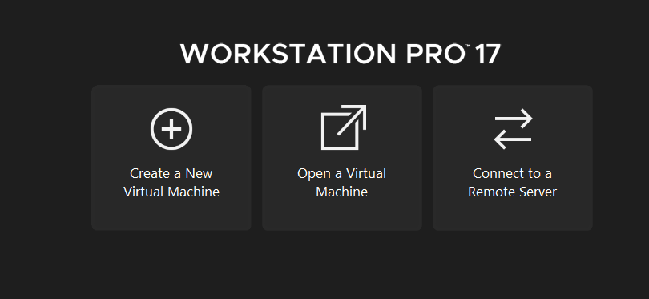

# Hướng dẫn cài đặt chương trình WINCAM CNC cho môn học CAD-CAM-CNC của CTU

Link tải phần mềm tại đây [link](https://drive.google.com/drive/folders/1kGjZQqTp6vLFJtB1hogBdFSJD0vARNh6?usp=sharing)

- Bước 1: Giải nén tệp tin đã chọn
- Bước 2: Cài đặt phần mềm VMware để cài đặt WINDXP ảo (chạy file VMware-workstation-full-17.5.0-22583795 (1).exe) khi cài đặt nhớ chú ý bỏ chọn phần kiểm tra update để tránh bị update.
- Bước 3: Khi cài xong VMware thì sẽ được yêu cầu nhập Key. Bạn cần mở file keyWM17.txt và copy một trong các key trong file để chạy tiếp
- Bước 4: Sắp xong rồi nha! bạn mở phần mềm VMware và làm theo các bước dưới đây
   
 1. Chọn vào Open a Virtual Machine
   
  <picture>
  
</picture>
 
 2. Dẫn đến đường dẫn thư mục đã giải nén ban đầu để mở WINDXP ảo lên
   
 
  <picture>
  
</picture>
   
3. Xong rồi! khi mở win lên được thì nó đã có đầy đủ các phần mềm cần thiết rồi
 
 
  <picture>
  
</picture>
 

Liên hệ hỗ trợ qua zalo: 0559092549 (Hữu Phước)

  

